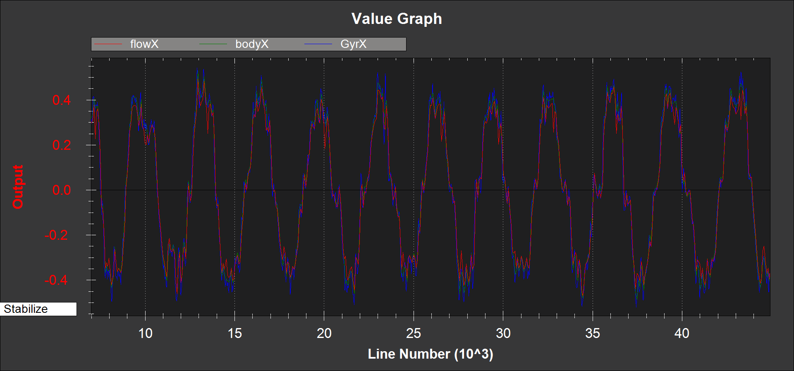

# PX4Flow光流传感器实现无人机定点飞行

标签（空格分隔）： 大一立项 笔记

---

# 开发前准备工作
## 确保飞机能在遥控器模式下以Stablize模式正常起飞，翻滚，俯仰和偏航
## 排坑总结：
- 如果飞机不能正常起飞，会始终向一侧倾斜：检查电调接线是否正确
- 检查飞行日志：绘制Pinch，Yaw，Roll的图像
- 阅读飞行日志的参考资料：https://blog.csdn.net/xazzh/article/details/72814567

# 安装PX4Flow
## 固件刷写和更新
## 镜头对焦
## 安装PX4Flow
Reference: https://blog.csdn.net/liberatetheus/article/details/77914246
## 启用PX4Flow
- 在MP打开所有参数表，在参数中设置FLOW_ENABLE为1
- 重启飞控
# 测试和试飞
## 看光流传感器是否工作
- 通过MissionPlanner链接到Pixhawk，选择首页左下方的“状态/Status”栏
- 如果设置正确，可以观察到非0的opt_m_x，opt_m_y和opt_qua的值
## 校准光流传感器
- 参数LOG_DISARMED设置为1（针对我们的固件版本3.4以上飞控，固件版本在刷写固件时可以看到；这个参数设为1，开启飞行日志的记录）
- 在Stablize模式下用遥控器起飞（此时飞行器上已安装光流）
- 做一个简单的飞行测试，即可降落
- 读取日志
- 绘制出OF.flowX OF.bodyX和IMU.GyrX的数据，三条图像应该大致重合

### 此处应当注意：这个部分我们不能按照官网指示进行，要按上述方法才能得到好的图像（排坑总结）
## 试飞
### 参数设定：
- EK2_GPS_TYPE=0（使用GPS作为卡尔曼滤波器输入）
- EK2_GPS_TYPE=3（使用光流作为卡尔曼滤波器输入）
- EK2_ALT_SOURCE=0（高度数据使用气压计）
- EK2_ALT_SOURCE=1（高度数据使用声纳）
注意：
- 要起飞前在“快速”界面检查Altitude是否正常，不正常，则可能是声纳没有正常工作，改高度数据源
- 先用GPS，气压计作为输入
# 正式飞行
- 遥控器要有三个模式：留待，自稳，land
- 以留待模式起飞，不正常马上切换到自稳
### 不能按照教程切换为land，很容易炸机

